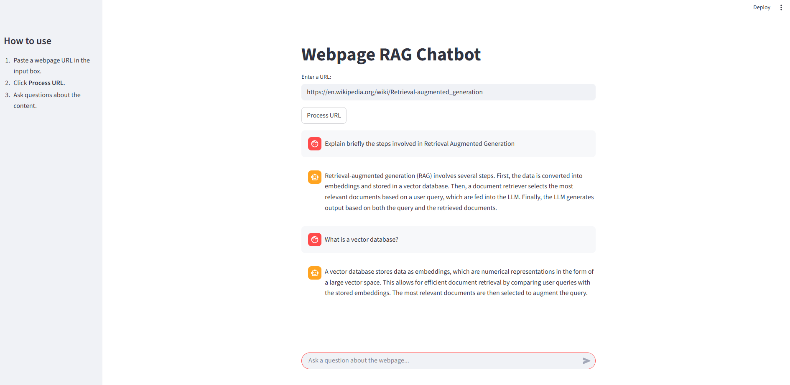

# RAG-powered Webpage QA with Gemini

A simple **Retrieval-Augmented Generation (RAG)** application that lets you paste any webpage URL and interact with its content using natural language questions. The app uses **LangChain**, **Gemini embeddings/LLM**, and **ChromaDB** for document retrieval, with a clean **Streamlit** web interface.

---

---
## Features
-  Load and index any webpage by providing its URL  
-  Split webpage content into chunks for efficient retrieval  
-  Store and search embeddings with ChromaDB  
-  Ask questions and get context-aware answers powered by **Gemini**  
-  Chat-style interface with conversation history  

---

## Tech Stack
- [Streamlit](https://streamlit.io/) – Web UI  
- [LangChain](https://www.langchain.com/) – RAG framework  
- [Google Gemini](https://ai.google/) – LLM + Embeddings  
- [Chroma](https://www.trychroma.com/) – Vector database  

---

## Project Structure

```bash
webpage-rag-chatbot/
├── app.py                  # Streamlit entrypoint (UI)
├── rag_backend/            # Core functions
│   ├── config.py           # setup_env()
│   ├── loader.py           # load_and_split()
│   ├── embeddings.py       # create_vector_database()
│   └── rag_chain.py        # build_rag_chain()
├── requirements.txt
├── .env
└── README.md
```
##  Setup

### 1. Clone the Repository
```bash
git clone https://github.com/sriz99/webpage-rag-chatbot.git
cd webpage-rag-chatbot
```
### 2. Create and activate a virtual environment
```bash
# Virtual Environment
python -m venv rag_chatbot 
source rag_chatbot/bin/activate # On Linux
rag_chatbot\Scripts\activate # On Windows
```
### 3. Install the dependencies
```bash
pip install -r requirements.txt
```

### 4. Add API Key

Create a `.env` file in the project root directory and add the following:
```bash
GOOGLE_API_KEY=your_api_key_here
USER_AGENT=your_user_agent_here
```
The Google API Key can generated from [Google AI Studio](https://aistudio.google.com/api-keys)

**USER_AGENT** for the webpage loader (`WebBaseLoader`) to fetch content.  
You can set this to a simple string that identifies your app, for example:

```bash
USER_AGENT=rag-webpage-chatbot/1.0
```

NOTE: Some websites may block requests without a user agent.
If you face loading issues, try setting it to something like:

```bash
USER_AGENT=Mozilla/5.0 (Windows NT 10.0; Win64; x64)
```
### 5. Run the Application
```bash
streamlit run app.py
```
Then open the app in your browser at the link generated in your terminal (usually http://localhost:8501).

## What this application does ? 

- This app lets you enter any webpage URL and interact with its content through a chatbot interface.
- It processes the webpage, stores the text in a vector database, and uses Retrieval-Augmented Generation (RAG) with Google Gemini to answer your questions.
- Instead of reading the entire page, you can simply ask questions and get concise, context-aware answers.

